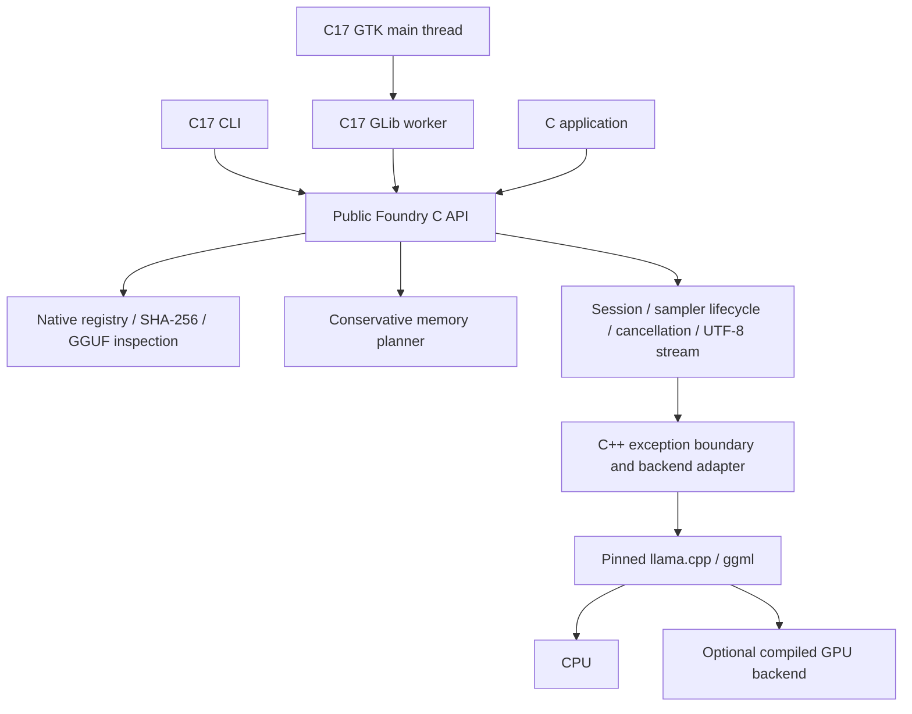

# Architecture

Upstream inference calls are isolated in `src/backends/llama/adapter.cpp`. The
core owns public handle lifetimes and request validation. llama.cpp owns weight
mapping, backend buffers, tokenizer execution, and computation. There are no
fixed-address mappings, weight expansion tricks, Python token loops, remote
fallbacks, or claims of reduced matrix computation.

Native inspection bounds metadata bytes, strings, array depth, counts, tensor
shapes, offsets, and known quantization extents before load. Unknown representation
information is preserved for inspection; the backend remains responsible for
execution validation. The product path uses only single-file decoder-only text
models. The memory estimator supports a limited conventional attention layout
and refuses architectures without an estimator.

`foundry_generate` starts a fresh KV history, tokenizes once, prefills in batches,
then incrementally decodes with reusable KV state. Chat keeps weights loaded and
stores roles/content independently of widget text. It currently renders and
prefills the full conversation each turn; there is no prefix-cache speed claim.

The GUI worker owns all runtime handles and copies callback bytes into a bounded
128-event queue. GTK drains it every 40 ms. Backpressure preserves token order;
cancel and close wake waiting producers. Session/generation IDs reject stale
callbacks. Window close requests cancellation and waits through the event loop
for cleanup acknowledgement before destroying widgets. Model loading itself has
no interrupt callback in the public API, so closing may wait for load to finish.

The core, CLI, and GUI are C17. Only the compute adapter and upstream implementation
are C++. System GTK platform integration may use other implementation languages.
See [decision 0001](decisions/0001-runtime.md).
